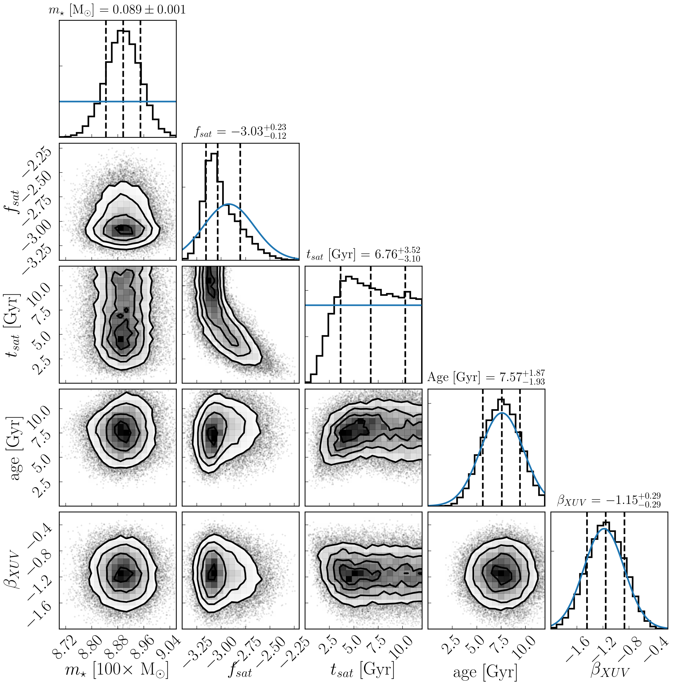

TRAPPIST-1 MCMC and approxposterior Posterior Distributions
===========================================================

Overview
--------

Plot the posterior probability distributions of the stellar mass, saturation
fraction, saturation timescale, age, and LXUV decay exponent derived from our
Markov Chain Monte Carlo analysis and using approxposterior.

===================   ============
**Date**              04/30/19
**Author**            David P. Fleming
**VPLanet Modules**   STELLAR
===================   ============

This example examines plots the posterior probability distributions of the
stellar mass, saturation fraction, saturation timescale, age, and LXUV
decay exponent from our true and approxposterior-derived MCMC chains.

To make the plot
----------------

.. code-block:: bash

    python plotCornerApproxOnlyTrappist1.py <pdf | png>

Expected output
---------------

   Posterior probability distribution for stellar mass, saturation fraction,
   saturation timescale, age, and LXUV decay exponent derived from our
   Markov Chain Monte Carlo analysis (density, black) and using approxposterior
   (contours, blue). approxposterior can accurately infer the posterior
   distribution, including the non-trivial correlation between model parameters,
   learning off of only 850 VPLanet simulations instead of the ~1,000,000 required
   for the true MCMC.
