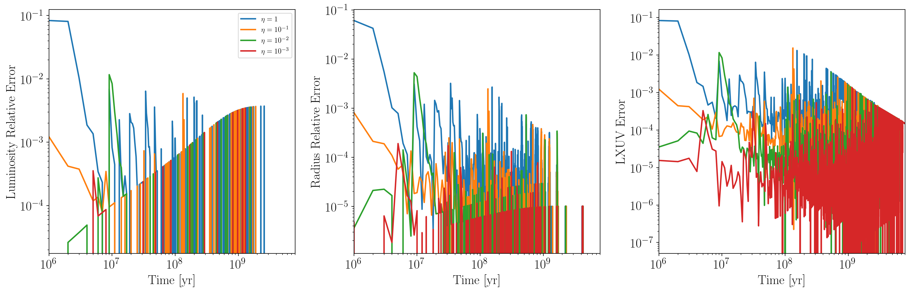

TRAPPIST-1 Stellar Evolution Convergence
========================================

Overview
--------

Plot convergence of stellar evolution quantities as a function of VPLanet's
timestepping parameter, dEta.

===================   ============
**Date**              04/30/19
**Author**            David P. Fleming
**Modules**           STELLAR
**Approx. runtime**   10 minutes
===================   ============

This example examines convergence of stellar evolution quantities as a function
of VPLanet's timestepping parameter, dEta. Note that this example relies on
VPLanet simulations that have already been ran in Sims/Convergence and its
subdirectories.

To run this example
-------------------

.. code-block:: bash

    python convergence.py <pdf | png>

Expected output
---------------

   Evolution of the luminosity, radius, and XUV luminosity, of TRAPPIST-1 using
   the fiducial parameters according to the Baraffe et al. (2015) stellar
   evolution tracks as a function of timestepping parameter, dEta. For simulations
   with relative errors <= 1.0e-2, use dEta <= 1.0e-1.
