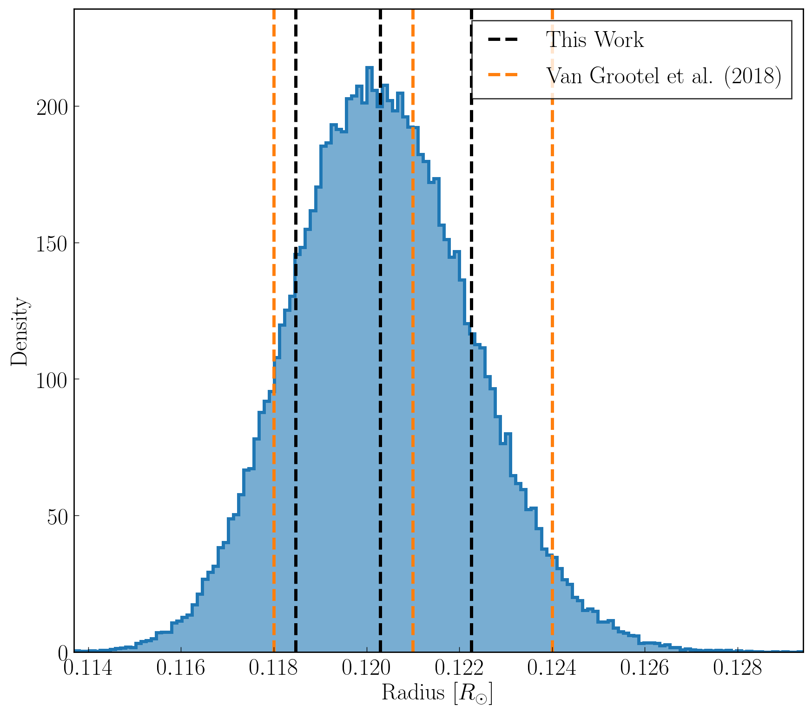

TRAPPIST-1 MCMC Posterior Distributions
=======================================

Overview
--------

Estimate TRAPPIST-1's radius using the mass posterior and density observation
from Delrez et al. (2018) following the procedure in Van Grootel et al. (2018).

===================   ============
**Date**              05/14/19
**Author**            David P. Fleming
===================   ============

This script calculates the radius constraint (median +/- = 16th, 84th
percentiles) and plots the histogram and constraints against the Van Grootel et
al. (2018) constraints.

To make the plot
----------------

.. code-block:: bash

    python estRad.py <pdf | png>

Expected output
---------------

   Derived distribution of TRAPPIST-1's radius using our stellar mass posterior
   distributions and the observed density (Delrez et al. (2018)). The black
   dashed vertical lines indicate the 50th, 16th, and 84th percentiles of our
   distribution and the orange dashed lines indicate the Van Grootel et al.
   (2018) stellar radius constraint.
