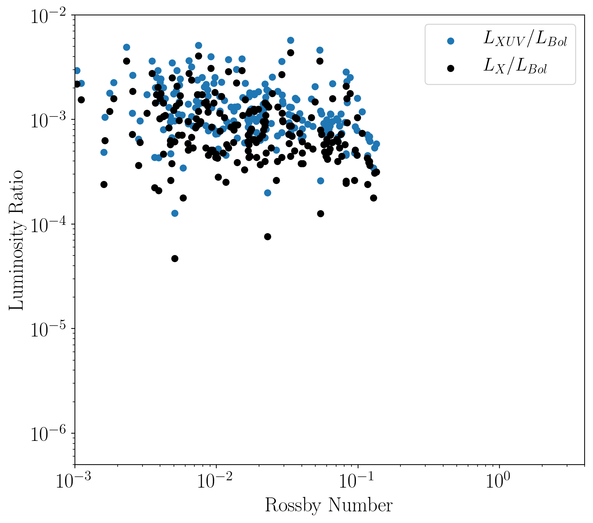
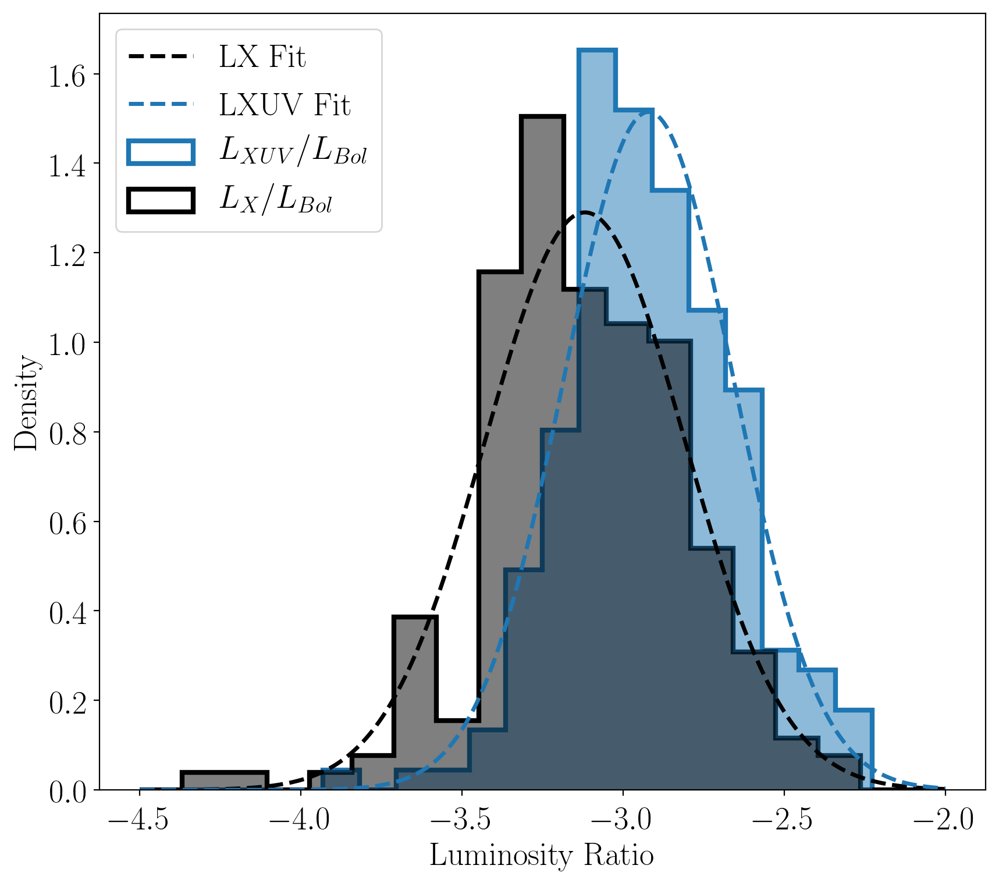

Fully-convective M dwarf XUV Saturation Fraction Distribution
=============================================================

Overview
--------

Estimate XUV fsat for fully-convective M dwarfs, and hence TRAPPIST-1 from Lx,
stellar parameters for fully-convective saturated stars in Wright et al. (2011).
We estimate LEUV (LXUV = LEUV + LX) as a function of LX using Eqn. 2 from
Chadney et al. (2015) following Wheatley et al. (2017) who showed that this
application was valid for TRAPPIST-1's modern fluxes, and hence late M dwarfs.

===================   ============
**Date**              05/14/19
**Author**            David P. Fleming
===================   ============

This script estimates an empirical XUV fsat distribution for fully-convective
M dwarfs. We define fsat as log10(LXUV/Lbol) and find the fsat distribution is
well-approximated by a Gaussian with mean = -2.92 and standard deviation = 0.26.

To make the plot
----------------

.. code-block:: bash

    python estXUVFsat.py <pdf | png>

Expected output
---------------

   Empirical Lx/Lbol (black) and LXUV/Lbol for saturated, fully-convective M
   dwarfs from the Wright et al. (2011) sample, with the latter computed in
   this work, as a function of Rossby number. Both distributions are consistent
   with a flat line near 10^-3, but with the LXUV ratio mean > Lx ratio mean.

  Empirical X and XUV fsat distribution overplotted with Gaussian fit. We find
  that the XUV sat distribution is well-approximated by a Gaussian with
  mean = -2.92 and standard deviation = 0.26 where we defined fsat as
  log10(LXUV/Lbol).
