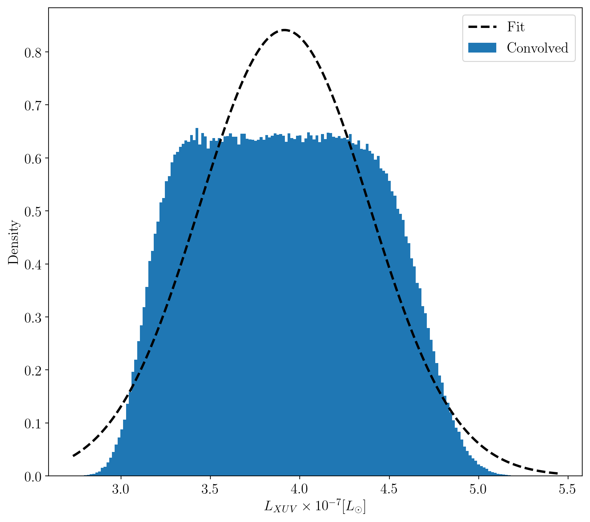

TRAPPIST-1 Radius Estimation
============================

Overview
--------

Estimates the distribution of TRAPPIST-1's XUV luminosity given the observations
from Wheatley et al. (2017), LXUV/LBOL in the range 6-9 x 10^-4, and the
observed bolometric luminosity from Van Grootel et al. (2018),
5.22 +/- 0.19 x 10^-4 Lsun.

We assume the Wheatley et al. (2017) LXUV/LBOL is distributed uniformly over the
quoted range and adopt the quoted normal distribution from Van Grootel et al.
(2018).

===================   ============
**Date**              05/14/19
**Author**            David P. Fleming
===================   ============

This script calculates TRAPPIST-1's observed luminosity given both the Wheatley
et al (2017) Lx observation and the Van Grootel et al. (2018) Lbol observation,
taking into account uncertanties from both measurements. We find that a Gaussian
with mean = 3.9e-7 Lsun and standard deviation = 0.5e-7 Lsun is a reasonable
approximation to the distribution.

To make the plot
----------------

.. code-block:: bash

    python estLXUV.py <pdf | png>

Expected output
---------------

   Estimated distribution of TRAPPIST-1's XUV luminosity by convolving the
   Wheatley et al. (2018) LXUV/Lbol measurement and the Van Grootel et al. (2018)
   Lbol measurement. We find that a Gaussian with mean = 3.9e-7 Lsun and
   standard deviation = 0.5e-7 Lsun is a reasonable approximation to the
   distribution.
