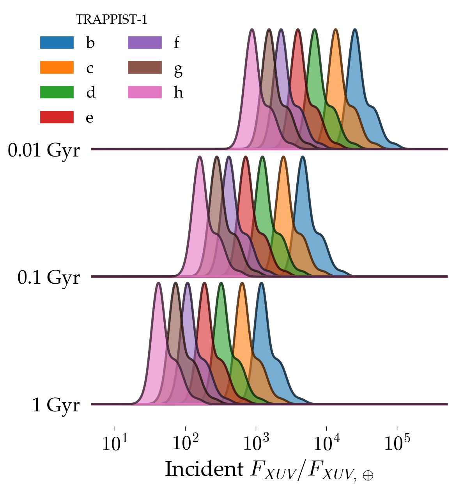

TRAPPIST-1 MCMC Posterior Distributions
=======================================

Overview
--------

This example examines plots the posterior distributions of the XUV flux each
TRAPPIST-1 planet likely received at various ages throughout the pre-main
sequence.

===================   ============
**Date**              06/04/19
**Author**            David P. Fleming
===================   ============

To make the plot
----------------

.. code-block:: bash

    python fluxes.py <pdf | png>

Expected output
---------------

   XUV flux received by each TRAPPIST-1 planet, normalized by Earth's, derived
   from the VPLanet evolutions of samples drawn from the posterior distribution
   when the system was 0.01, 0.1, and 1 Gyr old. The latter age corresponds to
   the approximate age at which TRAPPIST-1 entered the main sequence.
