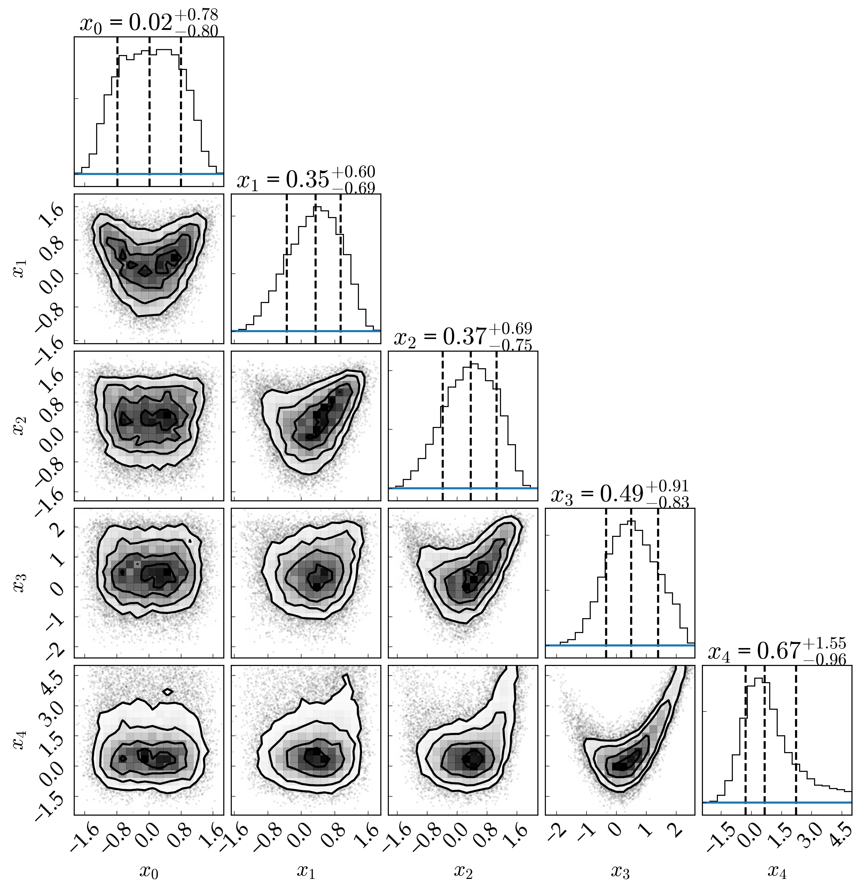

5-Dimensional Rosenbrock Function emcee MCMC inference
======================================================

Overview
--------

This example examines plots the posterior probability distributions of the
parameters in the synthetic Rosenbrock test likelihood function. NB: Running
this script for this first time can take awhile since it performs a rather
lengthy MCMC inference. The first run, however, caches the full MCMC chain
locally so mitigate the computational expense.

===================   ============
**Date**              11/12/19
**Author**            David P. Fleming
===================   ============

To make the plot
----------------

.. code-block:: bash

    python emceeR5D.py <pdf | png>

Expected output
---------------

   Posterior probability distribution for the synthetic 5-dimensional Rosenbrock
   function likelihood case derived from our Markov Chain Monte Carlo analysis
   (density, black) using emcee. We overplot each marginal distribution with the
   adopted prior distribution (blue lines). The non-linear form of our likelihood
   function yields non-Gaussian posterior distributions with banana-shaped
   correlations between parameters.
