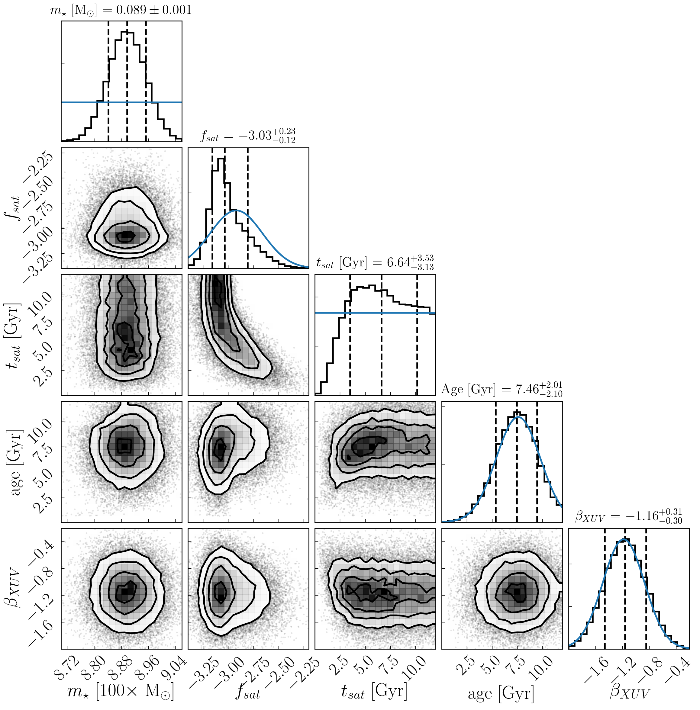

On the XUV Evolution of TRAPPIST-1
==================================

David P. Fleming, Rory Barnes, Jake VanderPlas, and Rodrigo Luger

We model the long-term XUV luminosity of TRAPPIST-1 to constrain the evolving
high-energy radiation environment experienced by its planetary system. Using
Markov Chain Monte Carlo (MCMC), we derive probabilistic constraints for TRAPPIST-1's
XUV evolution that account for observational uncertainties, degeneracies between
model parameters, and empirical data of low-mass stars. We infer that there is a
~43% chance that TRAPPIST-1 is still in the saturated phase today,
suggesting that TRAPPIST-1 maintained high activity and LXUV/Lbol ~ 10^-3 for Gyrs.
TRAPPIST-1's planetary system therefore likely experienced a persistent and extreme
XUV environment, potentially driving significant atmospheric erosion and loss of
volatiles. The inner-most planets, for example, likely received XUV fluxes
~10^3 - 10^4x that of the modern Earth during TRAPPIST-1's 1 Gyr-long
pre-main sequence phase. Deriving these constraints via MCMC is computationally
non-trivial, so scaling our methods to constrain the XUV evolution of a larger 
number of M dwarfs that harbor terrestrial exoplanets would incur significant
computational expenses. We demonstrate that approxposterior, a Python machine
learning package for approximate Bayesian inference using Gaussian processes,
can efficiently replicate our analysis, but requires $400\times$ less computational
time, a massive reduction in computational expense. Furthermore, the approximate
posterior distribution derived by approxposterior accurately reproduces the
MCMC-derived posterior distribution, including the non-trivial degeneracies between
parameters, demonstrating the utility of approxposterior for efficient
approximate Bayesian inference with slow models.

   Joint and marginal posterior probability distributions for the TRAPPIST-1
   stellar and XUV parameters made using corner
   Foreman-Mackey+2016. The black vertical dashed lines on the
   marginalized distributions indicate the median values and lower and upper
   uncertainties from the 16th and 84th percentiles, respectively. From the
   posterior, we infer that there is a 43% chance that TRAPPIST-1 is still
   in the saturated phase today, potentially driving significant water loss
   and atmospheric escape from its planets.
